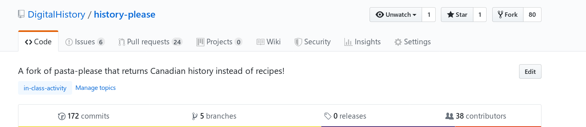
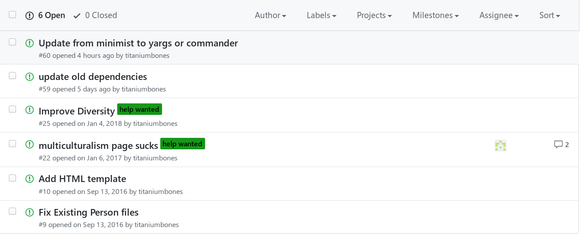

# History please!
:maple_leaf::maple_leaf::maple_leaf::maple_leaf::maple_leaf::maple_leaf::maple_leaf::maple_leaf::maple_leaf:

This command line utility, designed as part of [Digital History](https://digitalhistory.github.com),  will give you a random page about Canadian history. 

The file you're reading is called a `README`; by convention, every code repository contains a README file explaining how to use, install, and configure the code. Sometimes the file will contain other kind of information as well.  Since we're using this repo to understand [git](https://git-scm.com/) and [Github](https://github.com/), this README will talk about them as well. 

## What this program does

This simple program will return some information about a person, event, or trend in Canadian history. All of this information has been collected and inputted by students in past years of Digital History. If you're visiting this repository as part of a class exercise, you'll be contributing too!

## How to Participate

If you want to **use** this tool, see [Installation](#installation) and [Usage](#usage) below. But if you're a student, the first thing you need to learn is how to **participate in making it better**.

### Code Overview, Mostly for Students

If you're reading this file from the [repository home page on Github](https://github.com/DigitalHistory/history-please/), you'll see something like this near the top of the page (the details wil lbe a bit different, don't worry about that for now): 



You'll see that  **<>Code** is currently highlighted, and just below the tabs -- above this text you're reading -- is a table showing the structure of the repository. By clicking on these links, you can see the contents of every file in the project.

In the main directory, you'll see
- `index.js`: this is a JavaScript file that creates the graphical interface to this project
- `index.html`: used by `index.js` to build the views
- `package.json`: "metadata" about this project, used for purposes we don't need to talk about right now. [You can read more about it here if you're interested. ](https://docs.npmjs.com/files/package.json).

These are all files that you will probably be able to understand by the *end** of class. Today, they might feel a bit mysterious. The same will be true for the files in `bin` and `lib`, both JavaScripfiles -- the first is the command-line interface to our data, and `lib` helps `index.js` build the graphical interface. 

The files you're most likely to work on today are inside the subdirectories of `history`: `events`, `people`, and `trends`. Each file in these directories is written in [Markdown](https://www.markdownguide.org), a "[lightweight markup language](https://en.wikipedia.org/wiki/Lightweight_markup_language)" that makes it easy for human beings to write text that a browser can render in a sensible way. Each file has a small amount of information about a person, event, or historical trend that has been important in Canadian history.

Adding new files, and improving existing ones, is a great way to contribute to the project. 

### Issues

If you click on the [Issues tab](https://github.com/DigitalHistory/history-please/issues) above, you'll find yourself in front of another list. It will look a little like this: 



Each "issue" is a request for improvement. Some of them are technical in nature, and others have to do with the historical content in the application. Colored labels attached to issues sort them into categories, such as `Help Wanted` or `First timers`. Clicking on an issue link will take you to a more detailed description of the issue, where you can also find conversations.

These issues are another good place to start if you'd like to improve the project. 

### Pull Requests 

The next tab is `Pull Requests`. When you edit or create a file in Github's online interface, you'll be offered the chance to create a Pull Request. This will allow your changes to be `merged` into the main repository. Github pull requests look a lot like Issues, but they are a bit more complicated. Try making some changes, creating a pull request, and explore.  

### Detailed contribution Instructions

First, [register with Github](https://github.com/join) 

Optionally, "fork" this repository by clicking the "fork" button on the top right of this page. (this is sort of the "right" thing to do, but it will make your life a little bit harder.)

Once you have an account, you can make changes to this repository directly from the Github repository web page. Add *historical figures* by clicking the `Create New File` button (top right) to add a new file to the `history/people` folder:


Similarly, add *events* to the `history/events` folder, and *trends* to the `history/trends` folder. Be sure to name the file "some-persons-name.md" (or "some-event-name.md", or "some-trend-name.md") so that everyone, and also the Github server, knows it's written in Markdown. Speaking of which, you will need to use the markdown syntax:

```markdown
# Level 1 headline, for titles
## level 2 headline, for outline elements
### maybe you feel like a level 3 headline?
> quote
*italics* _also italics_
**bold** __also bold__
[link text](link URL)

- list item
- another list item 
```

For more details, [check out the Github Markdown cheatsheet](https://github.com/adam-p/markdown-here/wiki/Markdown-Cheatsheet)

Once you have written a description description to your satisfaction, submit a "pull request" by committing your changes and ticking the "Create a new branch for this commit and start a pull request" box.

I'll respond with comments and eventually commit the changes, and we can all enjoy them!


## Installation

Back to the user guide! 

First, [install node](https://nodejs.org/en/download/). Then, using the command line (terminal in Mac or Linux, Command Prompt or PowerShell in Windows), type:

```
npm install -g history-please
```

## Usage
You have to use the command line again:
```bash
history-please    # Returns a page
--people          # Returns a person
--events        # Returns an event
--trends        # Returns a trend
```

If you clone the repo on your computer (see below), you can simply run it from the repository directly instead of installing:

```bash
$ git clone https://github.com/DigitalHistory/history-please.git
$ npm install
$ node bin/history-please.js
```
(the `$` means "command prompt" -- it's not part of the actual command).

You can also try:

```
$ npm install -g electron
$ npm install
$ electron .
```
in the root directory. This will give you access to the graphical application. 

### Updating

To update a cloned repository, type

``` bash
$ git pull origin master
```

The npm package will only update when a new release happens, usually once before, and once after, the class in which we work with this tool. 

