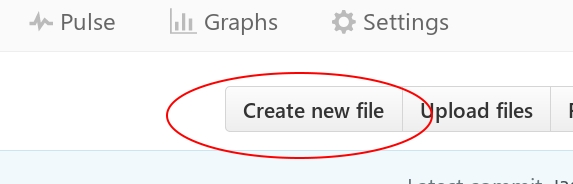

# History please!
:maple_leaf::maple_leaf::maple_leaf::maple_leaf::maple_leaf::maple_leaf::maple_leaf::maple_leaf::maple_leaf:

This command line utility will give you a random page about Canadian history.

## Installation
First, [install node](https://nodejs.org/en/download/). Then, using the command line (terminal in Mac or Linux, Command Prompt or PowerShell in Windows), type:

```
npm install -g history-please
```

## Usage
You have to use the command line again:
```bash
history-please    # Returns a page
--people          # Returns a person
--events        # Returns an event
--trends        # Returns a trend
```

If you clone the repo on your computer (see below), you can simply run it from the repository directly instead of installing:

```bash
$ npm install
$ node bin/history-please.js
```
(the `$` means "command prompt" -- it's not part of the actual command).

You can also try:

```
$ npm install
$ electron .
```
in the root cirectory

## Contributing

First, [register with Github](https://github.com/join) and then "fork" this repository by clicking the "fork" button on the top right of this page.

Once you have an account, you can make changes to this repository directly from the Github repository web page. Add *historical figures* by clicking the `Create New File` button (top right) to add a new file to the `history/people` folder:


Similarly, add *events* to the `history/events` folder, and *trends* to the `history/trends` folder. Be sure to name the file "some-persons-name.md" (or "some-event-name.md", or "some-trend-name.md") so that everyone, and also the Github server, knows it's written in Markdown. Speaking of which, you will need to use the markdown syntax:

```markdown
# Level 1 headline, for titles
## level 2 headline, for outline elements
### maybe you feel like a level 3 headline?
> quote
[link text](link URL)
*italics*
**bold**

etc.
- list item
- another list item 
```

For more details, [check out the Github Markdown cheatsheet](https://github.com/adam-p/markdown-here/wiki/Markdown-Cheatsheet)

Once you have written a description description to your satisfaction, submit a "pull request" by committing your changes and ticking the "Create a new branch for this commit and start a pull request" box.

I'll respond with comments and eventually commit the changes, and we can all enjoy them!
